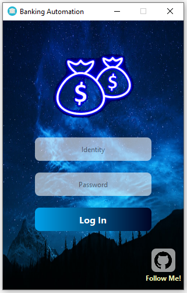
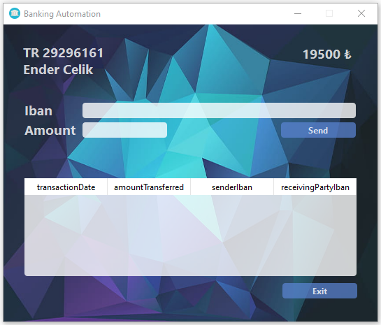
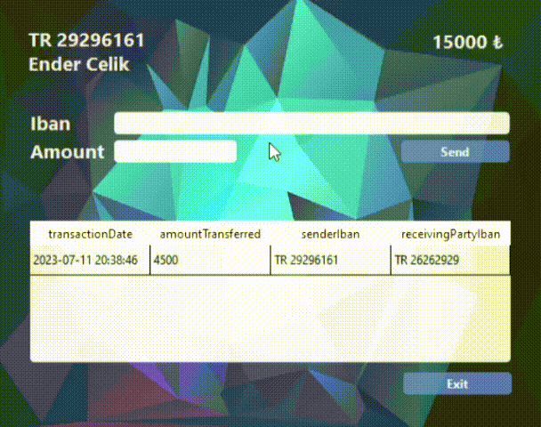

    
# Banking-Automation
> Banking Automation Project with Qt and SQLite

The aim of the project is to simulate a banking application where users can send money using their IBAN information through a local database powered by SQLite. Additionally, these transfer, deposit, and withdrawal etc. transactions are recorded in the .init file.

> ## Screenshots:
> You can follow people:
> |   |   |
> | -- | -- |
> 
> Money transfer:
> |  |
> | -- |